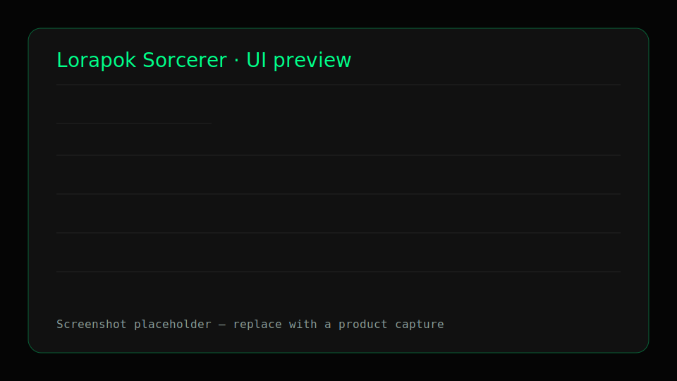

# ✦ Lorapok Sorcerer

**A Lorapok Labs product for original-media discovery and Discord delivery.**


> Building the Future. One Line at a Time.



## Highlights

- **Image Max URL engine** resolves original media across thousands of sites.
- **Smart context menus** handle images, links, and selected text.
- **Preview-first workflow** with candidate switching, zoom, notes, and IMU
  provenance.
- **Discord-native delivery** uploads image/video files with formatted embeds
  and a resilient URL fallback.
- **Cross-browser builds** for Firefox MV2 and Chrome/Edge/Opera/Brave MV3.
- **Lorapok design system** with accessible dark glass UI, history, and
  channel management.

## Quickstart

```sh
npm ci
./scripts/test.sh
./scripts/build.sh all
```

Archives are written to:

```text
dist/lorapok-sorcerer-firefox-2.0.0.zip
dist/lorapok-sorcerer-chromium-2.0.0.zip
```

See [docs/INSTALL.md](docs/INSTALL.md) for browser-specific loading and
publishing instructions.

## Documentation

- [Architecture](docs/ARCHITECTURE.md)
- [Features](docs/FEATURES.md)
- [Installation](docs/INSTALL.md)
- [Publishing](docs/PUBLISH.md)
- [Credits and licenses](docs/CREDITS.md)

## License

Lorapok Sorcerer application code is licensed under the MIT License. The
vendored Image Max URL source remains under Apache-2.0; see
`src/vendor/maxurl/LICENSE.txt`, `src/vendor/maxurl/ATTRIBUTION.md`, and
[docs/CREDITS.md](docs/CREDITS.md). The webextension polyfill retains its
upstream MPL-2.0 license.
