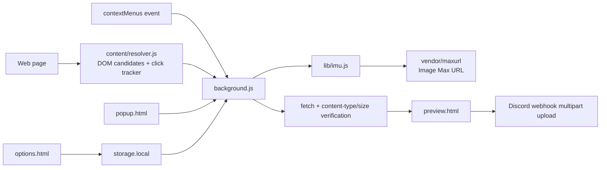

# Architecture

Lorapok Sorcerer is a plain JavaScript WebExtension with shared source and
target-specific manifests.

## Modules

- `src/js/content/resolver.js` records the last context-menu target and
  collects `srcset`, lazy attributes, links, metadata, and fast URL rules.
- `src/js/lib/url-rules.js` and `src/js/lib/srcset.js` are pure, tested helpers.
- `src/js/lib/imu.js` adapts Image Max URL's callback engine to a Promise and
  supplies its XHR-like `do_request` adapter.
- `src/js/background.js` merges candidates, runs IMU, verifies media, opens the
  preview, and uploads to Discord.
- `src/js/lib/discord.js` creates webhook payloads and filenames.
- `src/js/lib/storage.js` normalizes settings and recent history.

## MV2/MV3

Firefox uses `manifests/firefox.json` and a background-script array. Chromium
targets use `manifests/chromium.json` and `background-sw.js`, a service worker
that loads the same shared scripts with `importScripts`. The vendored
`webextension-polyfill` provides the promise-based `browser.*` API on both.

The IMU vendor build is compatible with the worker because it is loaded as a
classic script and exposes `globalThis.LorapokMaximage`. No DOM is used by the
background resolver. DOM inspection remains in the content script.

## Build flow

`scripts/build.sh firefox|chromium|all` creates a temporary target directory,
copies `src/`, substitutes the target manifest, lints it, and packages a ZIP.
No bundler or transpilation step is used.
