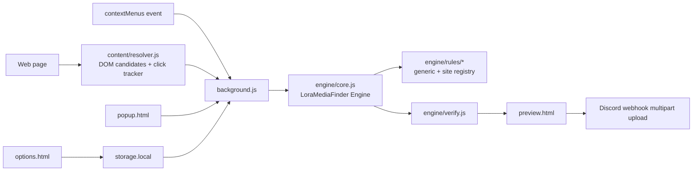

# Architecture

Lorapok Sorcerer is a plain JavaScript WebExtension with shared source and
target-specific manifests.

## Modules

- `src/js/content/resolver.js` records the last context-menu target and calls
  the engine's DOM collector.
- `src/js/engine/rules/dom.js` extracts `srcset`, lazy attributes, links,
  metadata, JSON-LD, and CSS background images.
- `src/js/engine/rules/generic.js` and `sites.js` provide pure URL rules.
- `src/js/engine/core.js` runs normalize → rules → score → dedupe.
- `src/js/engine/verify.js` is the injectable network verification stage.
- `src/js/background.js` runs the engine, verifies candidates, opens the
  preview, and uploads to Discord.
- `src/js/lib/discord.js` creates webhook payloads and filenames.
- `src/js/lib/storage.js` normalizes settings and recent history.

## MV2/MV3

Firefox uses `manifests/firefox.json` and a background-script array. Chromium
targets use `manifests/chromium.json` and `background-sw.js`, a service worker
that loads the same shared scripts with `importScripts`. The vendored
`webextension-polyfill` provides the promise-based `browser.*` API on both.

The LoraMediaFinder Engine is a standalone, no-network library loaded as
classic scripts in both background contexts and content scripts. DOM
inspection remains in the content script; fetch-based media verification is
isolated in `engine/verify.js` and background.js.

## Build flow

`scripts/build.sh firefox|chromium|all` creates a temporary target directory,
copies `src/`, substitutes the target manifest, lints it, and packages a ZIP.
No bundler or transpilation step is used.
